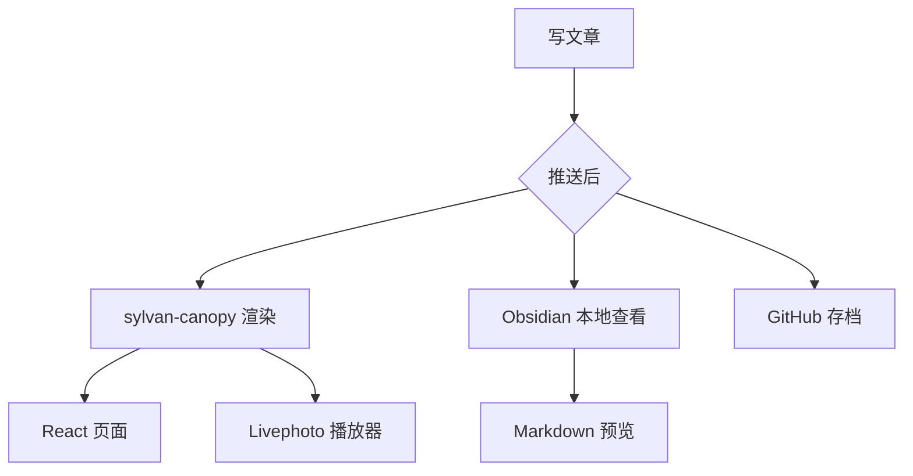
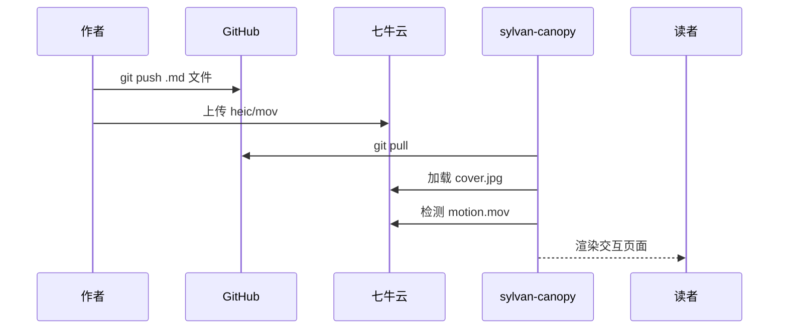
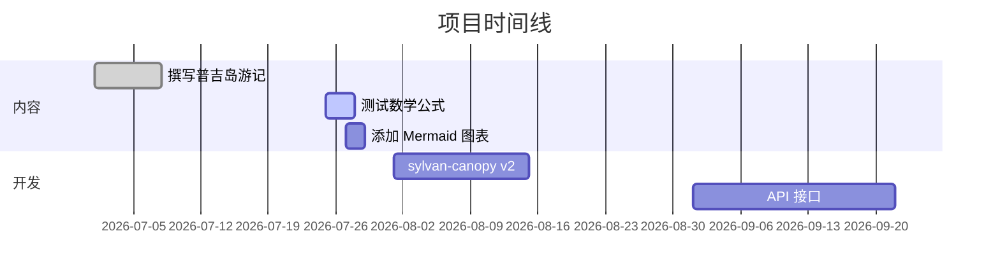

# 标题级别

## 二级标题

### 三级标题

#### 四级标题

##### 五级标题

###### 六级标题

## 文本样式

普通文本，**加粗**，*斜体*，***加粗斜体***，~~删除线~~，`行内代码`，<u>下划线</u>，==高亮==，上标 X^2^，下标 H~2~O。

## 引用

> 这是一级引用
>
> > 这是二级引用
> >
> > > 这是三级引用

> 生活就像一盒巧克力，你永远不知道下一颗是什么味道。
>
> ——《阿甘正传》

## 列表

### 无序列表

- 苹果
- 香蕉
- 樱桃
  - 车厘子
  - 黑樱桃
- 榴莲

### 有序列表

1. 第一步：打开 Obsidian
2. 第二步：创建文件
3. 第三步：撰写内容
4. 第四步：保存推送

### 任务列表

- [x] 完成 CLAUDE.md
- [x] 测试数学公式
- [ ] 测试 Mermaid 图表
- [ ] 测试 livephoto 渲染
- [ ] 推送到 GitHub

## 代码

### 行内代码

在终端中执行 `git push origin main` 即可部署。

### 代码块

```javascript
function greet(name) {
  console.log(`Hello, ${name}!`);
}

// 斐波那契数列
function fib(n) {
  if (n <= 1) return n;
  return fib(n - 1) + fib(n - 2);
}
```

```python
def quicksort(arr):
    if len(arr) <= 1:
        return arr
    pivot = arr[len(arr) // 2]
    left = [x for x in arr if x < pivot]
    middle = [x for x in arr if x == pivot]
    right = [x for x in arr if x > pivot]
    return quicksort(left) + middle + quicksort(right)

print(quicksort([3, 6, 8, 10, 1, 2, 1]))
```

```css
.container {
  display: grid;
  grid-template-columns: repeat(auto-fill, minmax(300px, 1fr));
  gap: 1.5rem;
  padding: 2rem;
}

.card {
  border-radius: 12px;
  box-shadow: 0 4px 6px rgba(0, 0, 0, 0.1);
  transition: transform 0.2s ease;
}
```

## 表格

| 渲染器 | Markdown | Frontmatter | Livephoto | 数学公式 |
|--------|----------|-------------|-----------|----------|
| Obsidian | ✅ | ✅ | ✅ 封面图 | ✅ |
| sylvan-canopy | ✅ | ✅ | ✅ 交互播放器 | 🚧 |
| VS Code 预览 | ✅ | ✅ | ✅ 封面图 | ⚠️ 需插件 |
| GitHub | ✅ | ✅ | ✅ 封面图 | ⚠️ 需插件 |

| 左对齐 | 居中 | 右对齐 |
|:-------|:----:|-------:|
| 左 | 中 | 右 |
| 单元格 | 单元格 | 单元格 |

## 链接与图片

- [GitHub](https://github.com/zzffan/sylvan-content)
- 内部链接：[需求说明](../../../sylvan-content-需求说明.md)
- 仓库内部引用：[AGENTS.md](../../../AGENTS.md)

封面图（七牛云 CDN）：


Livephoto 测试：


## 数学公式

### 行内公式

爱因斯坦的质能方程 $E = mc^2$ 是物理学最著名的公式之一。

勾股定理：$a^2 + b^2 = c^2$，其中 $c$ 是斜边长度。

欧拉公式：$e^{i\pi} + 1 = 0$

### 块级公式

泰勒展开：

$$
e^x = \sum_{n=0}^{\infty} \frac{x^n}{n!} = 1 + x + \frac{x^2}{2!} + \frac{x^3}{3!} + \cdots
$$

正态分布概率密度函数：

$$
f(x | \mu, \sigma^2) = \frac{1}{\sigma \sqrt{2\pi}} e^{-\frac{(x - \mu)^2}{2\sigma^2}}
$$

二次方程求根公式：

$$
x = \frac{-b \pm \sqrt{b^2 - 4ac}}{2a}
$$

麦克斯韦方程组（微分形式）：

$$
\begin{aligned}
\nabla \cdot \mathbf{E} &= \frac{\rho}{\varepsilon_0} \\[2pt]
\nabla \cdot \mathbf{B} &= 0 \\[2pt]
\nabla \times \mathbf{E} &= -\frac{\partial \mathbf{B}}{\partial t} \\[2pt]
\nabla \times \mathbf{B} &= \mu_0 \mathbf{J} + \mu_0 \varepsilon_0 \frac{\partial \mathbf{E}}{\partial t}
\end{aligned}
$$

矩阵：

$$
A = \begin{pmatrix}
a_{11} & a_{12} & \cdots & a_{1n} \\
a_{21} & a_{22} & \cdots & a_{2n} \\
\vdots & \vdots & \ddots & \vdots \\
a_{m1} & a_{m2} & \cdots & a_{mn}
\end{pmatrix}
$$

## Mermaid 图表







## 脚注

这是一个带脚注的句子[^1]，这里还有一个[^2]。

[^1]: 这是脚注一的内容，用于补充说明。
[^2]: 这是脚注二，可以写很长的注释文字。

## 水平线

---

***

---

## 定义列表

Markdown
: 一种轻量级标记语言，由 John Gruber 创建。

Frontmatter
: 文件开头的 YAML 元数据区域，用 `---` 包裹。

Livephoto
: Apple 的动态照片格式，包含一张静态图片和一段短影片。

## 折叠详情

<details>
<summary>点击展开查看更多</summary>

这里的代码演示如何解析 frontmatter：

```javascript
function parseFrontmatter(content) {
  const match = content.match(/^---\n([\s\S]*?)\n---\n([\s\S]*)$/);
  if (!match) return { metadata: {}, body: content };
  const metadata = YAML.parse(match[1]);
  return { metadata, body: match[2] };
}
```

</details>

## 混合测试

### 代码中的数学

要计算向量的模长：

```python
import math
v = [3, 4]
magnitude = math.sqrt(v[0]**2 + v[1]**2)
# 或者直接使用公式 $||\mathbf{v}|| = \sqrt{x^2 + y^2}$
print(magnitude)  # 5.0
```

### 引用中的公式

> 爱因斯坦说过：**想象力比知识更重要**。
>
> 但别忘了他的方程：$E = mc^2$

### 表格中的数学

| 操作 | 公式 | 结果 |
|------|------|------|
| 加法 | $a + b$ | 和 |
| 乘法 | $a \times b$ | 积 |
| 微分 | $\frac{d}{dx}x^n = nx^{n-1}$ | 导数 |
| 积分 | $\int_a^b f(x)\,dx$ | 面积 |

### 列表中的公式

- 牛顿第二定律：$\mathbf{F} = m\mathbf{a}$
- 相对论：$E = mc^2$
- 薛定谔方程：
  $$
  i\hbar\frac{\partial}{\partial t}|\Psi\rangle = \hat{H}|\Psi\rangle
  $$

### 嵌入 HTML

<div style="border: 1px solid #ccc; border-radius: 8px; padding: 16px; background: #f9f9f9;">
  <p style="color: #333; font-size: 1.1em;">
    <strong>HTML 卡片</strong>：这是一个用原生 HTML 嵌入的卡片。
    某些渲染器（如 sylvan-canopy）可能会过滤掉 HTML 标签，
    但 Obsidian 和大部分 Markdown 引擎支持。
  </p>
  <span style="display: inline-block; background: #42b883; color: #fff; padding: 4px 12px; border-radius: 4px;">
    Badge 标签
  </span>
</div>

## 特别大的文档测试

下面用数学公式测试长内容渲染是否正常：

### 傅里叶变换

$$
\hat{f}(\xi) = \int_{-\infty}^{\infty} f(x) e^{-2\pi i x \xi} \, dx
$$

### 拉普拉斯变换

$$
F(s) = \int_{0}^{\infty} f(t) e^{-st} \, dt
$$

### 统计学：贝叶斯定理

$$
P(A|B) = \frac{P(B|A) \, P(A)}{P(B)}
$$

### 线性回归

$$
\hat{\beta} = (X^T X)^{-1} X^T y
$$

### 信息熵

$$
H(X) = -\sum_{i=1}^{n} P(x_i) \log_b P(x_i)
$$

### 卷积

$$
(f * g)(t) = \int_{-\infty}^{\infty} f(\tau) g(t - \tau) \, d\tau
$$

---

**测试结束。** 如果以上所有格式都能正常渲染，说明消费端对 Markdown 的支持非常完善。
