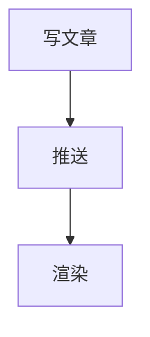

# Markdown 格式参考

> 来源：`content/tests/format-demo/index.md`
>
> 写文章时快速查阅此文档。此仓库支持的标准 Markdown 语法。

## 文本样式

```markdown
**加粗**    *斜体*    ***加粗斜体***
~~删除线~~  `行内代码`  <u>下划线</u>
==高亮==    上标 X^2^  下标 H~2~O
```

## 标题

```markdown
# 一级
## 二级
### 三级
#### 四级
##### 五级
###### 六级
```

## 引用

```markdown
> 一级引用
>
> > 二级引用
> >
> > > 三级引用
```

## 列表

```markdown
- 无序列表
  - 嵌套列表

1. 有序列表
2. 第二步

- [x] 已完成的任务
- [ ] 未完成的任务
```

## 代码

````markdown
行内: `git push origin main`

代码块:
```javascript
function greet(name) {
  console.log(`Hello, ${name}!`);
}
```
````

## 表格

```markdown
| 左对齐 | 居中 | 右对齐 |
|:-------|:----:|-------:|
| 左     | 中   | 右     |
```

## 链接与图片

```markdown
- [外部链接](https://example.com)
- [内部文件](../../相对路径.md)
- 
```

## 数学公式（LaTeX）

行内公式：`$E = mc^2$`

块级公式：

```latex
$$
x = \frac{-b \pm \sqrt{b^2 - 4ac}}{2a}
$$
```

支持：矩阵、微分、积分、求和、各种数学符号。

## Mermaid 图表

支持 flowchart、sequenceDiagram、gantt 等：

````markdown

````

## 其他

| 语法 | 示例 |
|------|------|
| 脚注 | `句子[^1]` + `[^1]: 注释内容` |
| 分隔线 | `---` 或 `***` |
| 定义列表 | `术语` 下一行 `: 解释` |
| 折叠详情 | `<details><summary>标题</summary>内容</details>` |
| 嵌入 HTML | `<div style="...">HTML 内容</div>` |

## 各端支持对照

| 语法 | Obsidian | sylvan-canopy | GitHub |
|------|----------|---------------|--------|
| 基础 Markdown | ✅ | ✅ | ✅ |
| Frontmatter | ✅ 属性面板 | ✅ | ✅ |
| LaTeX 公式 | ✅ | 🚧 规划中 | ⚠️ 需插件 |
| Mermaid | ✅ | ✅ | ✅ |
| Livephoto | ✅ 封面图 | ✅ 播放器 | ✅ 封面图 |
| 脚注 | ✅ | ✅ | ✅ |
| 任务列表 | ✅ | ✅ | ✅ |

## 完整测试文件

完整示例见 `content/tests/format-demo/index.md`。
