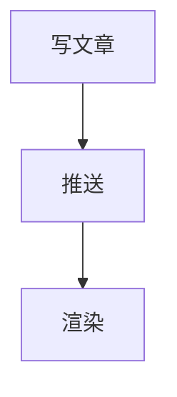
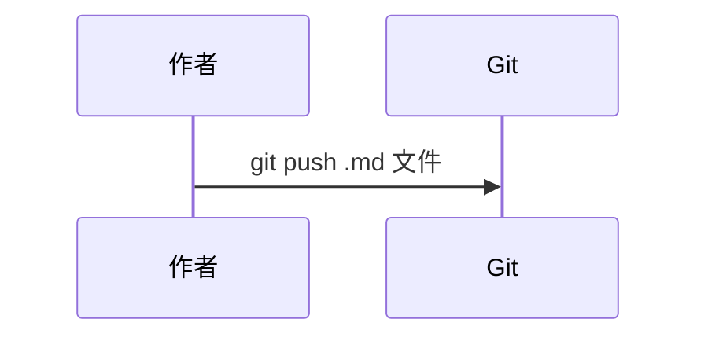
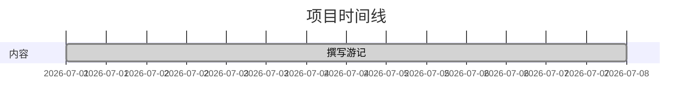

# 书写规范

> 来源：`content/tests/format-demo/index.md`（测试文件已归档，规范收录于此）
>
> 写文章时按此规范执行。本文定义了本仓库支持的标准 Markdown 子集与使用约定，涵盖了标题、样式、引用、列表、代码、表格、链接、公式、图表等全部可用的语法。

## Frontmatter

每篇文章以 `---` 包裹的 YAML 元数据开头。最少要求 `title` 和 `date`：

```yaml
---
title: 文章标题            # 必需，字符串
date: 2026-07-27          # 必需，ISO 8601 格式
section: travel           # 可选，分区名称，建议与 content/ 下子目录一致
tags: [thailand, beach]   # 可选，标签列表
cover: https://...jpg     # 可选，封面图 CDN URL
livephoto:                # 可选，视频数据
  video: https://...mov   #   视频 CDN URL
draft: false              # 可选，true 时列表页隐藏
featured: true            # 可选，标记为精选
---
```

## 标题层级

使用 `#` ～ `######` 六级标题。一级标题即文章主标题，正文从二级开始：

```markdown
# 一级标题（通常等于 title）
## 二级标题（正文章节）
### 三级标题（小节）
#### 四级标题
##### 五级标题
###### 六级标题
```

## 文本样式

```markdown
普通文本，**加粗**，*斜体*，***加粗斜体***，~~删除线~~，`行内代码`，<u>下划线</u>，==高亮==，上标 X^2^，下标 H~2~O。
```

## 引用

`>` 表示引用，多层 `>` 嵌套表示层级。可引用名言并署名：

```markdown
> 这是一级引用
>
> > 这是二级引用
> >
> > > 这是三级引用

> 生活就像一盒巧克力，你永远不知道下一颗是什么味道。
>
> ——《阿甘正传》
```

## 列表

### 无序列表

```markdown
- 苹果
- 香蕉
- 樱桃
  - 车厘子
  - 黑樱桃
- 榴莲
```

### 有序列表

```markdown
1. 第一步
2. 第二步
3. 第三步
```

### 任务列表

```markdown
- [x] 已完成的任务
- [ ] 未完成的任务
```

## 代码

行内代码用反引号包裹；代码块用三个反引号并标注语言，以获得高亮：

````markdown
行内代码：`git push origin main`

代码块：
```javascript
function greet(name) {
  console.log(`Hello, ${name}!`);
}
```
````

## 表格

表格使用管道符分隔，第二行声明对齐方式：

```markdown
| 左对齐 | 居中 | 右对齐 |
|:-------|:----:|-------:|
| 左     | 中   | 右     |
```

## 链接与图片

- 外部链接用标准 `[文字](URL)` 语法
- 内部链接使用仓库相对路径：`[需求说明](../../../sylvan-content-需求说明.md)`
- 图片必须使用完整七牛云 CDN URL，不走 Git：``

```markdown
- [GitHub](https://github.com/zzffan/sylvan-content)
- 内部链接：[需求说明](../../../sylvan-content-需求说明.md)
- 图片：
```

Livephoto 在正文中用 `` 引用，消费端自动检测 `motion.mov` 渲染播放器（详见 `docs/04-livephoto-system.md`）。

## 数学公式（LaTeX）

### 行内公式

`$...$` 包裹：

```markdown
爱因斯坦的质能方程 $E = mc^2$ 是物理学最著名的公式之一。
勾股定理：$a^2 + b^2 = c^2$，其中 $c$ 是斜边长度。
欧拉公式：$e^{i\pi} + 1 = 0$
```

### 块级公式

`$$...$$` 独立成块：

```markdown
$$
x = \frac{-b \pm \sqrt{b^2 - 4ac}}{2a}
$$
```

支持：矩阵（`\begin{pmatrix}`）、微分、积分、求和、多行对齐（`\begin{aligned}`）等常用 LaTeX 构造。

## Mermaid 图表

支持 flowchart（`graph`）、时序图（`sequenceDiagram`）、甘特图（`gantt`）等类型：

````markdown





````

## 其他语法

| 语法 | 写法 |
|------|------|
| 脚注 | `句子[^1]`，文末 `[^1]: 注释内容` |
| 分隔线 | `---` 或 `***` |
| 定义列表 | 术语独占一行，下一行以 `: ` 开头写解释 |
| 折叠详情 | `<details><summary>标题</summary>内容</details>` |
| 嵌入 HTML | `<div style="...">HTML 内容</div>` |

## 各端支持对照

| 语法 | Obsidian | sylvan-canopy | GitHub |
|------|----------|---------------|--------|
| 基础 Markdown | ✅ | ✅ | ✅ |
| Frontmatter | ✅ 属性面板 | ✅ | ✅ |
| LaTeX 公式 | ✅ | 🚧 规划中 | ⚠️ 需插件 |
| Mermaid | ✅ | ✅ | ✅ |
| Livephoto | ✅ 封面图 | ✅ 播放器 | ✅ 封面图 |
| 脚注 | ✅ | ✅ | ✅ |
| 任务列表 | ✅ | ✅ | ✅ |
| 嵌入 HTML | ✅ | ⚠️ 可能过滤 | ✅ |

## 写作要点

- 所有图片/视频使用完整的七牛云 CDN URL，绝不提交二进制文件
- 文件名与目录使用 kebab-case（如 `sunset-beach.md`）
- 正文中的公式、代码、图表均可混合使用，但注意各端支持差异（见上表）
- 发布前用 Obsidian 预览，确认无报错后再 `git push origin main`
